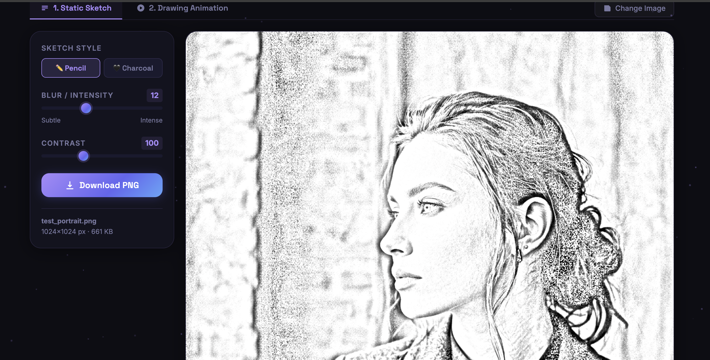
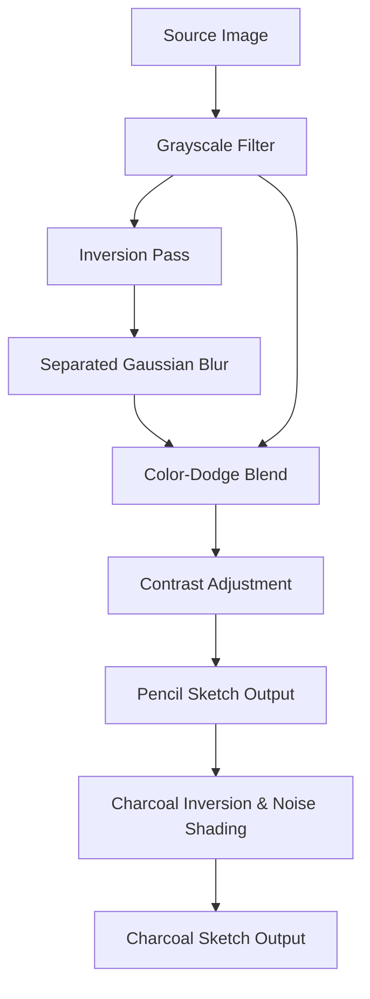

#  SketchCraft - Interactive Digital Sketch Generation and Animation Platform

<p align="center">
  
</p>

<p align="center">
  <strong>Convert any photo into a realistic pencil or charcoal sketch - entirely in the browser.</strong>
</p>

<p align="center">
  
  
  
  
  
</p>

---

SketchCraft is a lightweight, zero-dependency, client-side web application that transforms standard images into stunning, customizable hand-drawn sketches. It performs real-time canvas manipulations, generates organic stroke-by-stroke animations, and exports final creations as high-resolution PNGs or animated GIFs.

## Key Features

| Feature | Description | Tech Details |
| :--- | :--- | :--- |
|  **Static Sketch Engine** | Instantly convert images to realistic pencil or charcoal art. | Grayscale ➔ Inversion ➔ Separated Gaussian Blur ➔ Color-Dodge blending. |
|  **Style Profiles** | Switch styles dynamically with simple toggle controls. | Classic Pencil vs. Gritty Charcoal with noise-shading overlays. |
|  **Precision Control** | Tweak the sketch outputs to perfection. | Real-time sliders for Blur Radius, Pencil Intensity, and Output Contrast. |
|  **Drawing Animation** | Watch your artwork come to life stroke-by-stroke. | Custom block-shuffled pixel reveal system simulating organic sketches. |
|  **High-Res Export** | Save the final output in original resolution. | Full resolution download powered by `canvas.toBlob()`. |
|  **GIF Export** | Generate and export animated drawing process. | Vendored `gif.js` multi-threaded worker encoding with visual progress indicator. |
|  **100% Offline Capability** | Self-contained, secure, and ultra-fast. | Zero external CDN requests. No server upload. 100% private. |

---

##  Quick Start

### 1. Run Locally
Because SketchCraft is built purely with standard HTML5, CSS3, and JavaScript, you don't need any complex build pipelines.

#### Option A: Direct Open (Quickest)
Simply double-click `index.html` or run:
```bash
open index.html # macOS
xdg-open index.html # Linux
```

#### Option B: Local Web Server (Recommended)
Using a local server avoids browser CORS quirks when loading Web Workers (required for GIF exporting):
```bash
# Using Node.js
npx -y serve .

# Using Python
python3 -m http.server 8080
```
Then open your browser and navigate to `http://localhost:8080` (or the port specified).

---

##  Deploy to GitHub Pages

img1sketch is built to be serverless and fits perfectly on GitHub Pages with zero configuration!

1. **Push the repository** to GitHub. Make sure `index.html` is at the root directory of your repo.
2. Go to your repository settings on GitHub: **Settings ➔ Pages**.
3. Under the **Build and deployment** section:
   - **Source**: Select `Deploy from a branch`.
   - **Branch**: Select `main` (or `master`) and folder `/ (root)`.
4. Click **Save**.
5. Your app will be live at `https://<your-username>.github.io/<repo-name>/` in less than a minute!

> [!NOTE]
> **GIF Worker Path Resolution:** The application uses self-configuring paths to load `gif.worker.js`. This guarantees that the Web Worker resolves properly whether hosted at a custom domain root or inside a GitHub Pages repository subpath.

---

## How it Works under the Hood

### The Sketch Algorithm
SketchCraft utilizes a classic image-processing pipeline mapped onto the HTML5 2D Canvas:



1. **Grayscale:** Converts RGB pixels to luminance weights: $Y = 0.299R + 0.587G + 0.114B$.
2. **Inversion:** Inverts the grayscale values to create a negative ($255 - Y$).
3. **Separated Gaussian Blur:** Applies a 1D horizontal Gaussian kernel followed by a vertical pass. This keeps performance fast ($O(W \times H \times K)$ instead of $O(W \times H \times K^2)$).
4. **Color-Dodge Blend:** Combines the grayscale layer with the blurred negative:
   $$\text{Result} = \min\left(255, \frac{\text{Grayscale} \times 256}{255 - \text{Blurred}}\right)$$
   This highlights outlines and mimics graphite textures.
5. **Charcoal Mode:** Inverts the output, darkens midtones, and overlays fine grain noise.

### The Drawing Animation
Rather than standard fade-ins, the animation simulates an artist drawing:
1. **Edge Scanning:** The engine scans the sketch, gathering dark edge pixels below a luminance threshold.
2. **Spatial Chunking:** Pixels are grouped into $8 \times 8$ grid blocks.
3. **Organic Ordering:** Blocks are shuffled pseudo-randomly to prevent sterile scanlines. Within each block, pixels are sorted by darkness so outline sketches appear before fine details.
4. **Progressive Render:** A requestAnimationFrame loop paints batches of these sorted pixels onto a clean canvas.
5. **GIF Compilation:** Captured frame buffers are sent to a local Web Worker thread, compiling a high-performance GIF using `gif.js`.

---

## File Structure

```hl
SketchCraft/
├── index.html        # App layout, settings panel & Canvas views
├── style.css         # Modern dark theme, responsive grid controls
├── script.js         # core logic, Canvas rendering, and animation loops
├── libs/             # Offline dependencies
│   ├── gif.js        # gif.js compiler library
│   └── gif.worker.js # Multi-threaded GIF encoding worker
└── README.md         # Documentation & setup instructions
```

---

## License
This project is licensed under the MIT License. Feel free to use, modify, and distribute it as you wish.
